# Asset Manager

The paid for version of MakeTile comes with an Asset Manager and Browser and collection of premade assets and tiles you can use. This is now compatible with the new Blender Internal Asset Browser that was introduced in Blender 3.0. It supports Materials, Collections (such as MakeTile Tiles) and Objects.

It is necessary to continue developing the MakeTile asset browser for now as the Blender Internal browser doesn't currently support Collections and each tile created in MakeTile is a Collection. The MakeTile asset browser also contains a number of helper functions to make it easier to save assets to seperate files, organise your assets in separate folders and to edit assets. 

It works by linking to the .blend files in the folder you navigate to and then unlinking those files when you navigate to a new folder or close the asset bar. This has the slightly annoying side effect that when the asset bar is open you are able to choose from any material in any of the linked files in the blender default material panel. Close the asset bar to see only the materials in the current file.

If you used the 0.0.1 version of the MakeTile Asset Browser you will need to [convert your old assets](#converting-assets) to the new format.

## The Side Panel

The Asset Manager lives in its own **Asset Manager** tab in the side panel. At the top is a drop down that allows you to select the current **Asset Library**. When the Asset Manager addon is first installed it will create a MakeTile directory in your user directory with three subdirectories for collections, materials and objects. This directory will be marked as a library so it is accessible both in the MakeTile asset browser and in the Blender internal asset browser.

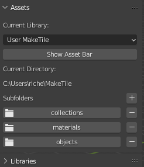

Clicking on **Show Asset Bar** or any of the folder names will display the asset bar at the bottom of the screen.

You can quickly add or remove subdirectories by clicking on the **+** or **-** icons. 

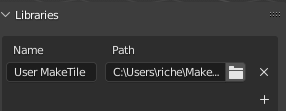

Clicking on the **Libraries** drop down will expand the sub-panel. Here you can rename, add and delete libraries. Deleting a library will not remove it and its contents from disk, it will just mean that the library is no longer selectable in the **Current Library** drop down.

## The Asset Bar
Clicking on **Show Asset Bar** or one of the folder names will display the asset bar at the bottom of the screen. This button will then change to **Hide Asset Bar**. You can also press **escape** or use **undo** to hide the asset bar.  

If there are no assets in the currently selected folder then the bar will be empty. This is different to the way the Blender Internal Asset Manager currently works. If you use the Blender Internal browser it will show all the assets in the current folder *and* any assets in any child subfolders. This is problematic because if you have many hundreds or thousands of assets saved as separate files in a folder structure then it becomes very difficult to find anything and Blender can grind to a halt as it has to read data from each file. 

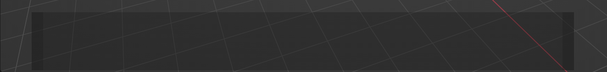
**Empty Asset Bar**

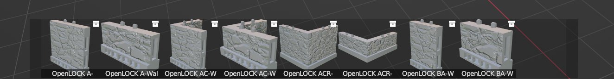
**Full Asset Bar**

You can scroll through the assets in a folder by hovering over the asset bar and using the mouse wheel or by clicking on each end of the asset bar. 

The type of each asset is indicated by the icon in the top right of its image.

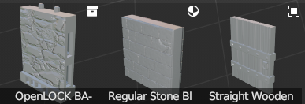

**Collection, Material and Object Asset Types**

When the asset bar is visible you can choose how to filter and sort the assets in the current folder. You can filter by asset type, name and description and sort by alphabetically or by modification date. Currently you can't filter by Tag.

Selecting an asset will display its information in the right hand panel. Currently you can only edit an asset's information if you are in the asset file. To [edit an asset and change these details](#editing-assets) click on the **Open Asset Blend File** button which will launch a new instance of Blender. Navigate to the asset you want to edit in the asset bar in the newly opened file and edit it there. Save the file and return to your original file. You will need to close and reopen the asset bar to see the details refresh.

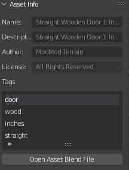
## Spawning Assets

To spawn an asset into the scene just left click and drag it from the asset bar. If you are spawning an **Object** or **Collection** into the scene you can choose whether to use rotation snapping to snap rotation to the face you drop the object on to and whether to randomise the rotation of the asset around the Z axis.

Collections such as Tiles will be added as children of the scene collection. Objects will be added to the currently active collection. You can change the currently active collection in the Outliner in the top right by selecting it.

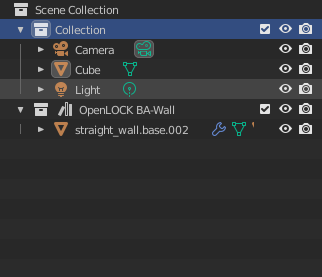

Dragging and dropping a material onto an object will add it to that object. If the object has vertex groups already defined (like a tile) then dragging and dropping a material onto an object will add the material only to the vertices in the vertex group under the cursor.

## Saving Assets
The asset manager contains helper operators to allow you to easily save objects, collections such as tiles and architectural elements, and materials as assets. Each asset is saved to its own file and by default will be saved in the **Current Directory** as shown in the side panel, although you can change this when you save an object.

### Saving Objects
To save an object to the MakeTile library select it in the Viewport and **right click.** Select **Save selected object to MakeTile library.** Fill in the metadata (you can add a default author and your own licenses in the [addon preferences](#preferences)) and click **OK**. If you save a single object you will be able to edit the name, however if you save multiple objects at once it will use the object name. The preview will be rendered using the material currently on the object.

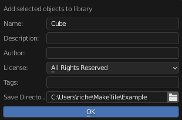

### Saving Collections
To save a collection such as a tile to the MakeTile Library select one of the objects in the collection in the Viewport and **right click.** Select **Save collection to library**.

Because an object can belong to more than one collection you can select the collection here and also select what type of collection you are saving (see below). You can also set the **Root Object**. This is the object that everything else in the collection is parented to. For a tile this should be the base. If you select **None** then an empty object will be added and the other objects parented to it so you can move the entire collection around when you spawn it into the scene.

If you select the **Other** or **Tile** collection type then clicking **OK** will save the collection to the library. Be aware that for complex collections with multiple objects in them this can take a few seconds as a preview needs to be rendered.

If you select the **Architectural Element** collection type another pop up will appear asking you to set various properties of each object in the collection. Architectural elements are intended to be added to tiles and buildings and consist of a number of objects that can either add to, subtract from or intersect with a tile. See my [Architectural Elements Video](https://www.youtube.com/watch?v=HlYkXHxRNWk&t=1575s) for a demonstration of how to create a doorway.

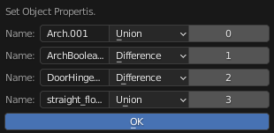

The left most column identifies the object in the collection. The center column shows whether the object will be added to (Union), subtracted from (Difference), or intersected with a tile when you use MakeTile's [Add collection to tile](#add-collection-to-tile) operator. The right most column shows the order in which the objects will be added to or subtracted from the tile starting from 0 and ascending.

### Saving materials.
You can save the active material of an object by selecting the object in the viewport and right clicking and selecting **Save active material to MakeTile Library**. You can also click on **Save Material** in the materials sub panel in the MakeTile right hand menu.
in the pop up

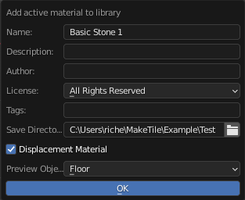

As well as the usual options you can choose what object to render the material preview on and whether to render it as a displacement (MakeTile) material.

## Deleting Assets
You can delete individual or multiple assets by selecting them in the asset bar and right clicking. Click **Delete Selected Assets**. Alternatively you can delete the asset file directly by navigating to it on your file system and deleting it. 

## Preferences
To set the preferences for the Asset manager go to **Edit > Preferences >Add-ons > Object: MakeTile Asset Manager** and click on the down arrow to expand the preferences section. You can add a default author that will appear when you save an object, material or collection.

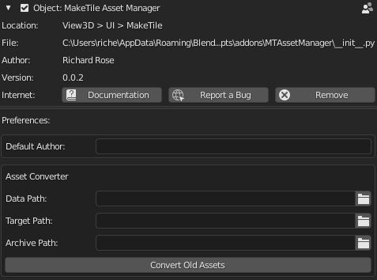

<!-- You can add a default author that will appear when you save an object, material or collection. and you can also add your own licenses if none of the default choices are suitable.  -->

### Converting Assets saved with old version of asset manager
If you used the old version of the Asset Manager you will need to convert the assets saved with that to the new version of the asset manager. This will also make them compatible with the Blender internal asset manager.

You will need to set the **Data Path** to the folder where the information for the old version of the asset browser is stored. First navigate to where you have saved your assets. By default this will be User/MakeTile. Next, locate the **Data** folder. This should contain 4 files - categories.json, collections.json, materials.json and objects.json

The **Target Path** is the folder where the new assets will be stored. A subfolder called **Converted Assets** will be created.

The **Archive Path** is the folder to move the old assets to. If you leave this blank they will remain where they are.

## Editing Assets
MakeTile saves each asset in its own file. To edit an Asset select it in the asset bar and then in the right hand panel click on the **Open Asset Blend File** button which will launch a new instance of Blender. Because this is a library file the scene will be empty, but don't worry, the asset is there! If you just want to edit the asset information open the asset bar and navigate to the asset. Edit the information in the side bar, save the file and return to your original file. You will need to close and reopen the asset bar to see the details refresh.

### Collections

To edit a collection such as a tile navigate to the file it is saved in as above and then go to the **Outliner** in the top right of the screen and click on the second drop down. Select **Blender File**. Expand the **Collections** entry and select the collection you want to edit. Right click and select **Link to Scene**. You will now see your collection in the 3D Viewport. Perform your edits and then save the file and return to your original file. You will need to close and reopen the asset bar to see the details refresh. It's important to note that just dragging and dropping your collection from the Outliner into the scene won;t make it editabler as doing this creates and instance of the collection.

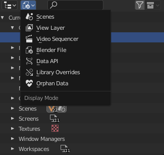

### Objects

To edit an object follow the same procedure as above and click **Link to active collection.** Your object should now appear in the scene. As with collections just dragging and dropping from the outliner into the scene won't work as expected as in this case doing so creates a copy of the object rather than linking the object to the scene.

## Materials

To edit a material you will need to first add an object into the scene (press shift-A). Open the **Shading** workspace, select your object and then in the material node editor select the material you want to edit from the drop down to add it to your object. Because MakeTile is installed you will also see the linked materials from the default material library. You can easily tell which material is the one you want to edit because it will have an **F** rather than an **LF** next to it.

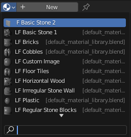

## Add collection to tile