# Welcome to MakeTile

MakeTile is a custom dungeon tile creator for [Blender](https://www.blender.org/) - the free, open source 3D modelling program. Using MakeTile you can simply and easily create 3D printable tiles of the exact dimensions you need, add procedurally generated, customizable materials to make them look like stone, wood, brick etc. hit the Make3D button and export them for printing.

You can download the [prototype](https://github.com/richeyrose/make-tile/releases) version of MakeTile today from GitHub. (Be warned, here be bugs!).

If you back MakeTile on [Kickstarter](https://www.kickstarter.com/projects/modmodterrain/maketile-custom-dungeon-tile-creator) you will get access to additional tile types and materials.

Check out my [YouTube](https://www.youtube.com/channel/UC7TUNzEtli-sQRj5anS7DFA) channel for more hints and tips.

## Installing MakeTile
1. MakeTile is an add-on for Blender. First [download](https://www.blender.org/download/) the latest build of Blender and install it. If you've not used Blender before I *strongly* advise that you first take a look at the first five Blender fundamentals [videos](https://www.youtube.com/playlist?list=PLa1F2ddGya_-UvuAqHAksYnB0qL9yWDO6) on the official Blender YouTube channel. These will teach you the basics of viewport navigation, the Blender interface and how to add and delete objects. It should take you no more than 30 minutes.
2. Download the latest build of MakeTile. If you are downloading the prototype or community version you can download the latest version from [here](https://github.com/richeyrose/make-tile/releases). If you have supported MakeTile on Kickstarter you will be emailed a link to download your supported version when the campaign is over. If you;re downloading the prototype click on the **Assets** drop down and download the **MakeTile.zip** file. This contains several materials and meshes that are needed for MakeTile to work which aren't included in the source. **Do not unzip this file!!!** Blender uses the .zip file directly to install add-ons and if you unzip it the installation will silently fail.
3. Launch Blender and click anywhere in 3D space to get rid of the splash screen.
4. In the top menu go to **Edit** > **Preferences** > **Add-ons** > **Install...** Select the .zip file you have just downloaded and click on **Install Add-on.** After a few seconds MakeTile should appear. If it doesn't use the search box in the top right. Click on the box to the left of MakeTile to activate it. Close the preferences window.

## Quickstart guide
MakeTile lives in its own tab in the right hand menu. Press **N** to show or hide this menu and click on the MakeTile tab to access its options.

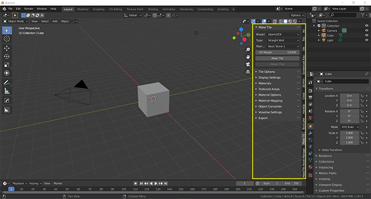

To create your first tile select the default cube by left clicking and press **delete**. In the right hand menu leave the defaults as they are and click on the **MakeTile** button. Congratulations, you have just made your first tile!

Currently your tile will be blank, so in the **Display Settings** panel click on **Create lighting setup.** Blender should think for a second or two and now your tile should be in glorious 3D!

You will notice that as you rotate around the scene the viewport doesn't update instantaneously. This is because we are currently in Cycles mode, which is Blender's none real time renderer, which we need to use to preview our tiles in 3D. When we're in Cycles mode the 3D displacement is being calculated in the shader and it is not yet "real" geometry.

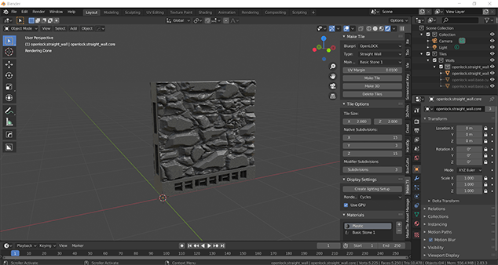

To switch to Blender's realtime renderer, Eevee, either select **Eevee** in the drop down menu in the **Display Settings** panel or click on the **Material Preview** icon in the horizontal menu bar above the MakeTile menu.

You should still be able to see the material on your tile, but it should now be a flat texture rather than being 3D and the viewport should now be updating smoothly.

To make your tile truly 3D, select the main part of the tile and click on the **Make 3D** button in the top panel of the MakeTile menu. Blender will think for a second or two and then the tile will appear in 3D. What you are seeing now is real geometry that we can export and print.

Hover your mouse over the MakeTile menu and scroll with the scroll wheel down to the bottom where you'll find the **Export Panel**. Expand the panel, make sure your tile is selected, and click on the **Export Tile** button. Blender will now pause for a few moments while MakeTile does its magic before exporting your tile to the folder in the **Export Path** box. By default this will be in your user\MakeTile directory. You can change this path before exporting your tile by clicking on the folder icon, and you can change the default path in the MakeTile add-on preferences. Your tile is now ready to slice and print!

## Moving tiles
Each tile created by MakeTile is a collection of objects which need to move together in order for MakeTile to function correctly. Because of this you can only move the base of a tile. When you do this everything else related to that tile will move with it.

You can move objects in Blender by pressing **g** or by clicking on the **Move** icon 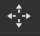 in the left hand sidebar and using the move gizmo.

If you want to create a layout or building with your tiles then it is a good idea to turn on grid snap. Click on the little magnet icon at the top of the screen to turn snap on and then in the drop down menu to the side make sure that **Absolute Grid Snap** is checked.

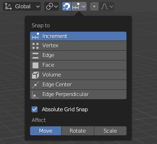

## Deleting Tiles
If you want to delete a tile you should use the **Delete Tiles** button in the top panel of the MakeTile menu rather than pressing delete. This will delete all objects that make up that tile. You can also delete a tile by going to the outliner on the right hand side, selecting the tile collection, right clicking, and selecting **Delete Hierarchy**. This is useful for if you've accidentally deleted part of a tile.

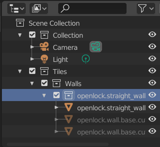

## Tile Blueprints
When creating a tile you can choose the tile blueprint and the tile type from the MakeTile panel drop down. There are currently three tile blueprints supported: OpenLOCK tiles, plain tiles and custom tiles.

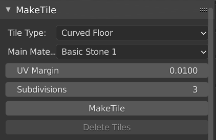

OpenLOCK tiles are fully compatible with the OpenLOCK system from Printable Scenery and have sockets on the bases, and for walls, on ther sides also. Plain tiles have no sockets on either the bases or the sides. Custom tiles can either have plain bases, OpenLOCK bases or no bases and can also have either plain, OpenLOCK or no textured parts. This is useful if you want to create a tile where the material goes all the way to the ground, but you still want to use the OpenLOCK side clips, or you want to create an OpenLOCK compatible base for a custom tile or object.

If you create a tile without a base MakeTile will create an empty which it will parent the rest of the tile to. This will appear as a black cross and it is this you should select in order to move your tile.

## Tile Types
The tile type (Straight wall, Rectangular floor, Curved wall etc.) can be chosen in the **Type** drop down. Each tile type is customisable and a set of different options will appear in the **Tile Options** panel allowing you to set the size of your tile on creation, along with other parameters such as base angle and leg length for corner tiles or triangular floor tiles. Currently once you have created a tile you cannot change its dimensions.

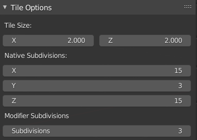

## Swapping Materials
You can choose what material to add to your tile on creation in the **Main Material** drop down in the main panel. If you want to change this after creation then  make sure the main part of your tile is selected, go to the **Materials** panel, click on the name of the material that is currently on your tile and select a new material from the drop down menu.

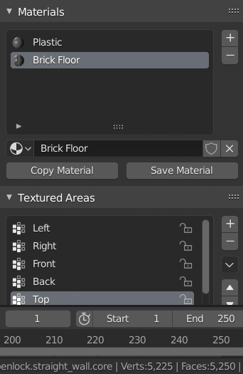

## Adding a Material to part of a tile
Select the main bit of your tile then click **+** in the **Materials** panel. Select your material from the drop down menu and then in the **Textured Areas** panel select the area you want the material to be applied to. Click on **Assign Material**. Removing a material works in the same way.

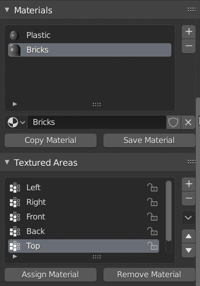

## Customising your Material
The materials in MakeTile are procedural which means you can change the parameters to alter the way they look. Clicking on the **Material Options** drop down will show all the different parameters you can change for a given material. As well as being able to change the location, rotation and scale of all the materials you will be able to change different parameters for different materials, such as the width of mortar on bricks, or the closeness of the grain on wood.

All materials have at least one **Seed** parameter in the **Randomise** subheading. Changing this number will generate a new random variant of that material. Changing the **Strength** parameter will change the amount the material projects from the surface before you press the Make3D button and the **Displacement Strength** will alter this after you have made your tile 3D.

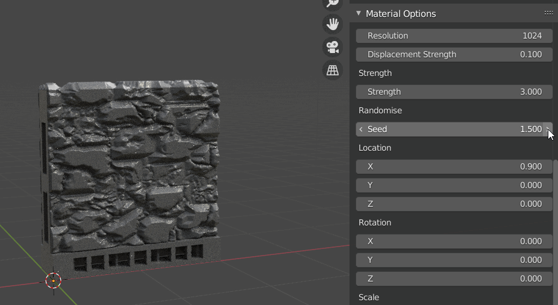

## Duplicating and saving materials
Before editing a material it is a good idea to duplicate it and then work on the duplicate. Don't worry if you've forgotten to do this, you can't overwrite the included materials and the originals will be there when you restart blender.

To copy a material, select the material in the **Materials** panel and click **Copy Material**. You can then either assign this new material to different areas of your tile or you can select the original material slot and change it to your new material. To save a material click on the **Save Material** button.

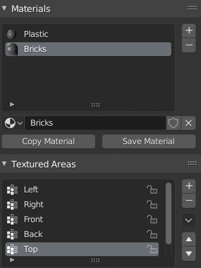

## Material Mapping and Material Errors
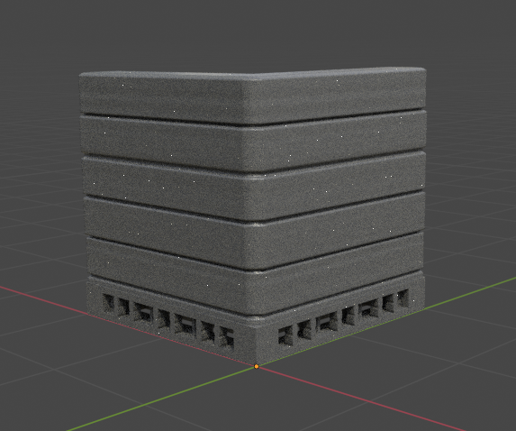

If your material is distorted and looks something like this don't worry! This happens because a tile has been rotated. To fix this make sure one of the tiles with that material on is selected and go to the **Materials** panel in the MakeTile menu. Select the material that is showing incorrectly and then come down to the **Material Mapping** panel. Select the eye dropper in the **Reference Object** box and select an object in the scene that has not been rotated. If you need to add an object to do this press **shift + a** or click on **Add** in the top left of the main window and add an empty.

The material should now display correctly. You can also change the material mapping method to **Triplanar** if your tile is a floor tile, or a straight wall tile, or a corner tile with a 90 degree angle and it should display correctly.

## Exporting
MakeTile treats 1 Blender unit (one grid square) as 1 inch or cm because of how the tile generators work. Because this is a different default scale to other 3D programs you need to rescale objects on export for them to print at the correct size. Because of this you shouldn't use **File** > **Export** > **STL** but instead use MakeTile's built in exporter which will rescale your tiles and more besides. You can choose which units your exported tiles will be in using the **Units** drop down menu. By default this is inches, which is what the OpenLOCK system uses.

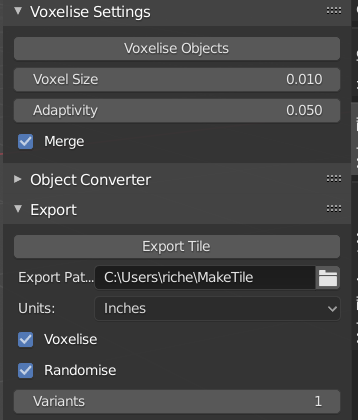

## Random Variants
On export MakeTile can generate random variants. You can choose how many variants to create by ensuring the **Randomise** box is checked and entering the number of variants in the **Variants** box.

## Voxelising
By default MakeTile will also voxelise and simplify your tiles on export. It does this because in order for MakeTile to work it needs to subdivide the tile many times which creates meshes with millions of polygons. MakeTile also needs to fuse the base and main parts of the mesh together and doing this by voxelisation is less likely to create geometry errors that will prevent you from printing than using the usual method of booleaning objects together.

You can set the Voxel size in the **Voxelise Settings** panel. Smaller voxels mean higher quality, but take longer. **Adaptivity** is the amount of post voxelisation simplification that is applied. The higher this number is the more the resulting mesh will be simplified and the lower the final polygon count will be.

If you have **Randomise** unchecked and you have not clciked on **Make3D** MakeTile will export a blank tile without any material applied to it.

## Exporting multiple tiles
You can export multiple tiles (and multiple variants of each tile) at once by selecting multiple tiles before clicking **Export Tile.**

If you have chosen to export a large number of variants, or have selected many tiles to export at once, the exporter may take several minutes to run and Blender may have appeared to have crashed. You can check that the exporter is still working by opening up the folder which you have selected to export to and check that files are being created in it by MakeTile.

## Changing the export path
You can choose the export path in the **Export Path** box before exporting your tiles. You can change the default export path by going to **Edit** > **Preferences** > **Add-Ons** > **Object: MakeTile** clicking on the down arrow and then setting the **Export Path**

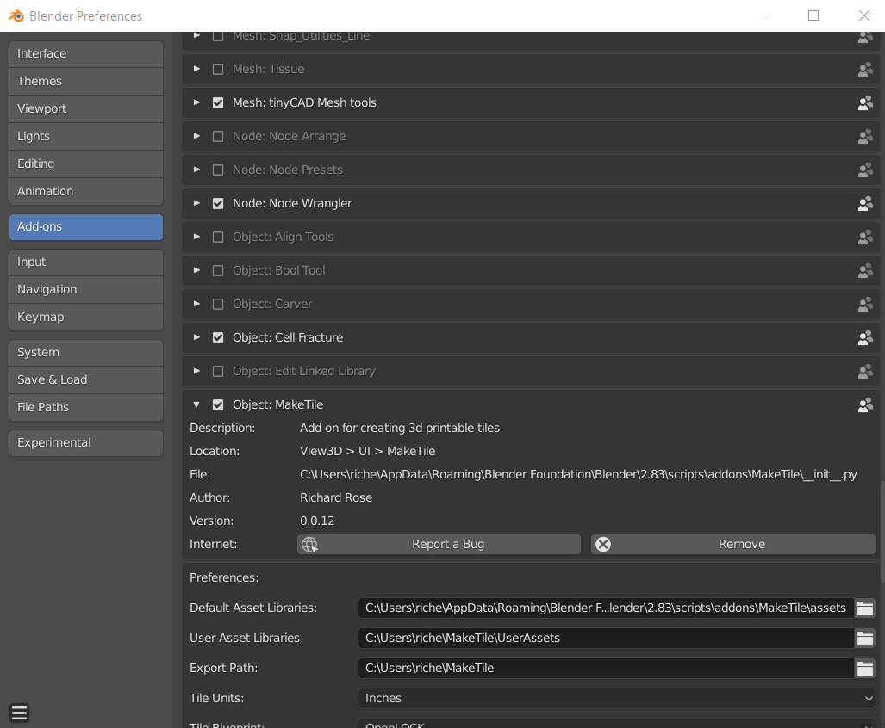

## Importing
You can use the MakeTile material system with your own meshes and also add props to your tiles. To import a mesh go to **File** > **Import** and choose the file format of the mesh you wish to import (usually .stl or .obj).

## Rescaling imported objects
You will probably need to rescale your imported object as MakeTile and Blender use a different default scale to many 3D programs with 1 Blender unit (default grid square) equalling 1 Inch or cm. You can rescale objects manually by pressing **s** or using the scale tool in the left hand menu .

If you have imported an object that you know is the correct size in a slicer, you can rescale it automatically to either inches or cm by going to the **Object Converter** panel in the MakeTile menu, selecting the **Tile Units**, selecting your object, and clicking on **Rescale Object.**

## Using MakeTile's material system with imported objects
You can use MakeTile's material system with an imported object by selecting it and clicking on the **Convert to MakeTile Object** button in the **Object Converter** panel in the MakeTile menu. For a guide on how to convert a blank tile template for use with MakeTile that will take you through the whole process see this video.

[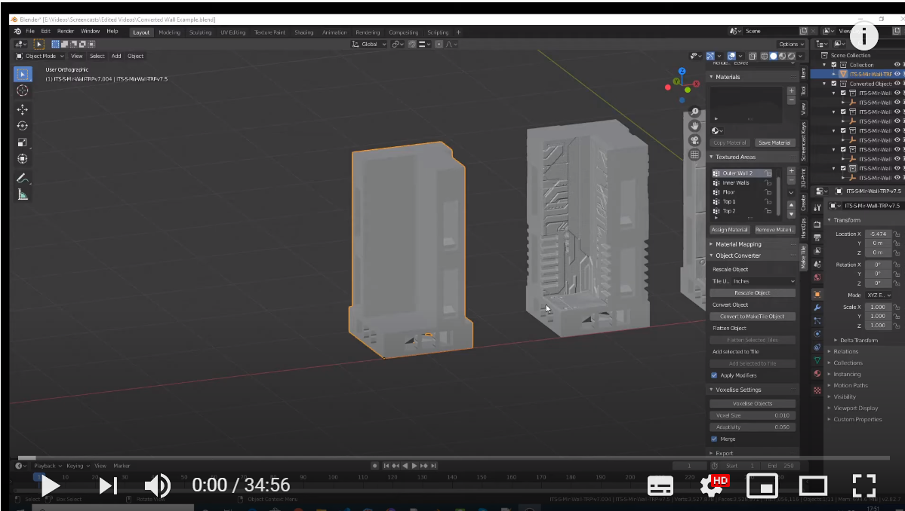](https://www.youtube.com/watch?v=h-Ayb_r4dls)

## Adding props to your tiles
If you want to add a prop to your tile, import and rescale your prop. Position it where you would like it to be on your tile. Select the prop and then select the tile. In the **Object Converter** panel click the **Add Selected to Tile** button. If you generate several variants on export the prop will appear on each tile. If you have **Voxelise** selected on export the prop will be merged with your tile on export.
