# Tile Types

## Connecting Column
Connecting column tiles can be used to connect or terminate walls in 5 different ways.

### Tile Options
#### Column Type
##### I Column
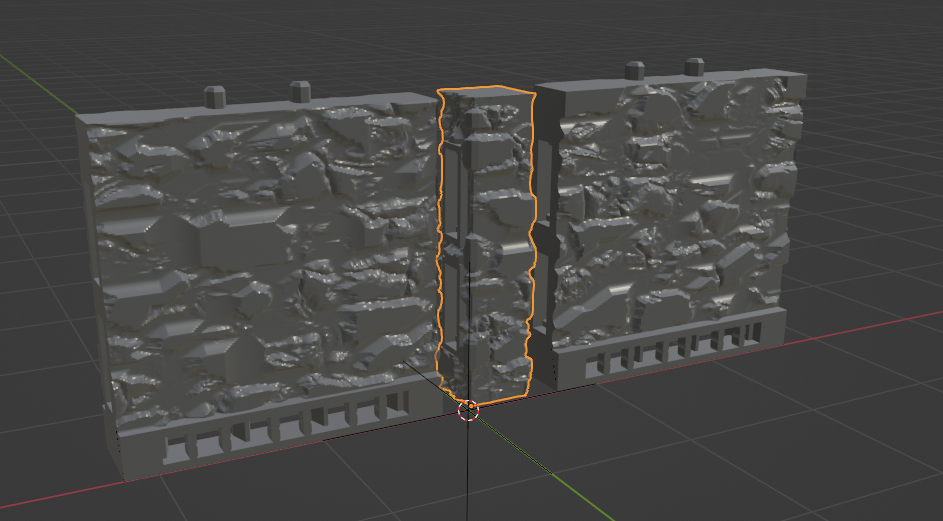
I columns can be used to connect two walls in a straight line.
##### L Column
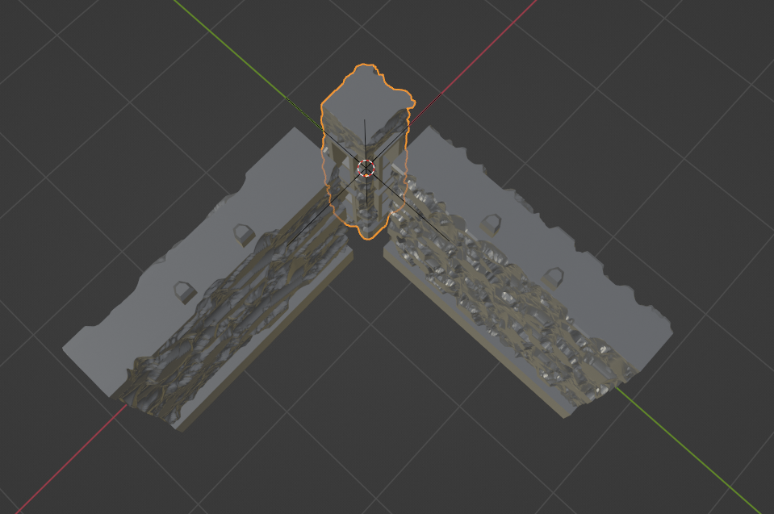
L columns can be used to connect two walls at a right angle.
##### O Column
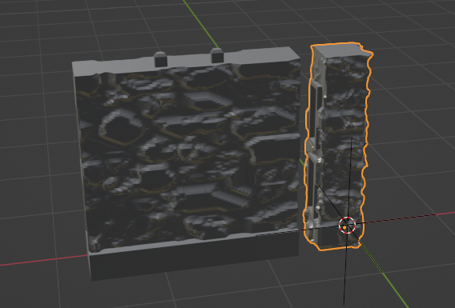
O Columns can be used to terminate a wall.
##### T Column
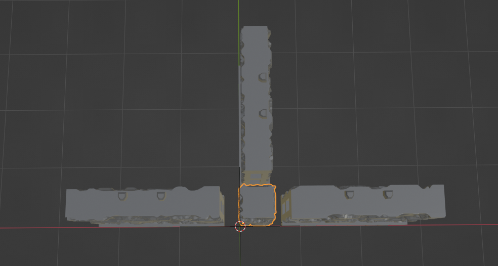
T Columns can be used to connect 3 walls at right angles.
##### X Column
X Columns can be used to connect 4 walls at right angles
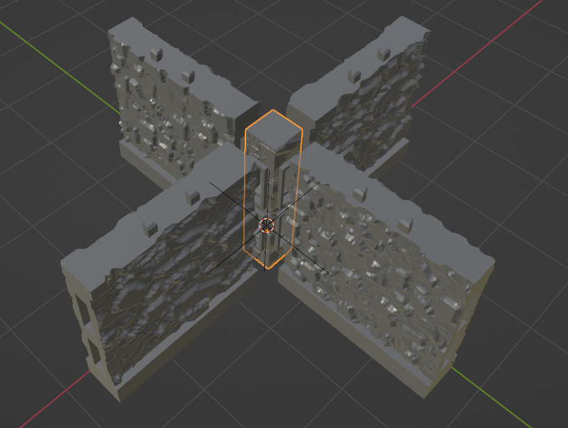

#### Socket Style
If you are making a column with OpenLOCK style sockets you can choose whether you want the socketed side(s) to be textured (the default) or flat.

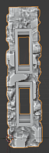    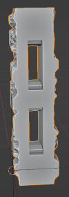

#### Base
You can choose from three base types - None (the default), OpenLOCK, and Plain.

#### Base Socket Type
If you choose the OpenLOCK base type you can choose from OpenLOCK or LastLOCK style sockets. LastLOCK sockets are compatible with openLOCK style clips but can also be used with ball magnets.

If you choose the OpenLOCK base type you can choose from OpenLOCK or LastLOCK style sockets. LastLOCK sockets are compatible with openLOCK style clips but can also be used with ball magnets.

#### Main
You can choose the main part of the tile to be Plain, OpenLOCK or it can be omitted alltogether if you choose None

#### Column Material
The material to be applied to the main part of the column.

#### Column Size
The size of the tile including the base after it has been made 3D.

#### Sync Proportions
Whether to sync the size of the tile with the size of the base.

#### Base Size
The size of the base.

#### Subdivision Density
The density of the tile on creation. This cannot be changed after creation.

#### UV Island Margin
The gap between UV islands on the displacement texture created when you click Make3D. Tweak this is you get the texture projecting where it shouldn't.

#### Displacement Thickness
Thickness of the displacement texture.

## Curved Floor
A curved floor type tile analagous to the curved wall tile. Because of the "Curve Texture" option it can be useful for creating decorative borders.
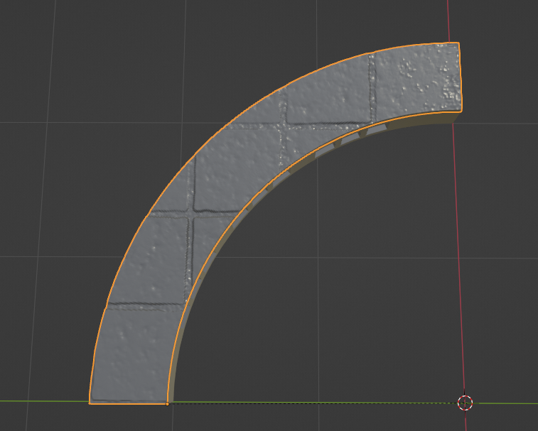
### Tile Options

#### Base
You can choose from three base types - None, OpenLOCK (the default), and Plain.

#### Base Socket Type
If you choose the OpenLOCK base type you can choose from OpenLOCK or LastLOCK style sockets. LastLOCK sockets are compatible with openLOCK style clips but can also be used with ball magnets.

#### Floor Material
Set the material to apply to the floor.

#### Curve Texture
You can choose whether to distort the texture to follow the curve of the tile when you Make3D. This will only show up when you Make3D and not in preview mode.

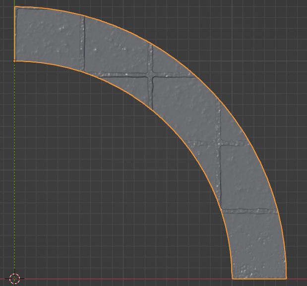
Curve Texture off

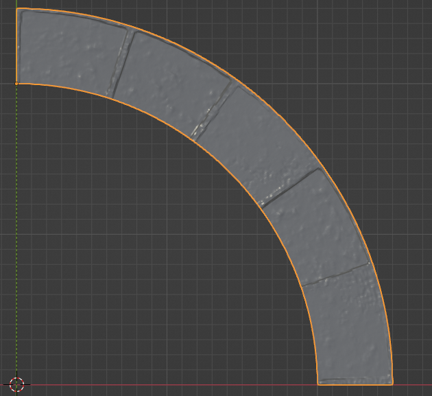
The same tile with the same material but with Curve Texture on.

#### Height
The overall height of the tiles
#### Radius
The radius of the tile as measured at the inner arc.
#### Degrees of arc
How many degrees the tile covers
#### Socket Side
Which side the sockets are on

#### Core Properties
The width of the textured portion of the tile.

#### Sync Proportions
Whether to sync the size of the tile with the size of the base.

#### Base Properties
The width of the base as measured from the inner arc to the outer arc.
##### Height
The height of the base.

#### Subdivision Density
The density of the tile on creation. This cannot be changed after creation.

#### UV Island Margin
The gap between UV islands on the displacement texture created when you click Make3D. Tweak this is you get the texture projecting where it shouldn't.

## Curved Wall
Used for creating curved wall tiles. Because of the way the material system works textures will look distorted on these tiles prior to clicking Make3D.

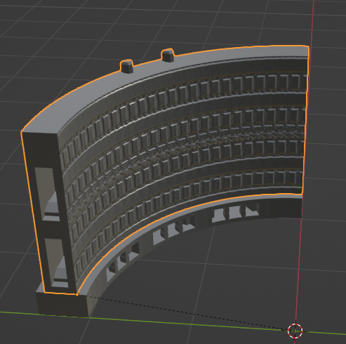

Curved wall with Brick material in preview mode

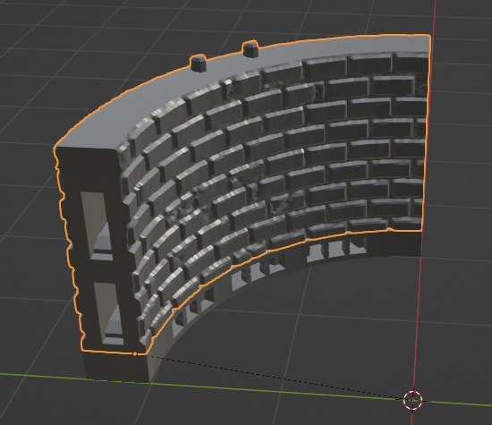

Curved wall with Brick Material after clicking Make3D

### Tile Options

#### Base
You have 5 options. OpenLOCK (the default), OpenLOCK S-Wall which is a wall on floor type tile. None, which will entirely omit the base, Plain and Plain S-Wall.

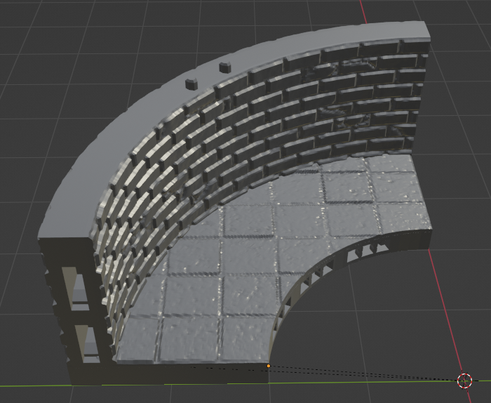
An OpenLOCK S-Wall

#### Main
You can choose the main part of the tile to be Plain, OpenLOCK or it can be omitted alltogether if you choose None

#### Base Socket Type
If you choose the OpenLOCK base type you can choose from OpenLOCK or LastLOCK style sockets. LastLOCK sockets are compatible with openLOCK style clips but can also be used with ball magnets.

#### Floor Material
The material to apply to the floor if you are using a S-Wall

#### Wall Material
The material to apply to the wall.

#### Tile Properties
##### Height
The overall height of the tile

##### Radius
The radius of the tile at the inner arc.

##### Degrees of arc
Degrees of arc covered by the tile

##### Socket Side
Whether the socket is on the inner or outer side.

#### Curve Texture
Whether to curve the texture.

#### Core Properties
##### Width
The width of the wall.

#### Floor Thickness
The thickness of the floor if creating an S-Wall.

#### Wall Position
Whether the wall is positioned in the center or on the edge of the tile.

#### Sync Proportions
Whether to sync the proportions of the base and the main part of the tile.

#### Base Properties
##### Width
The width of the base.
##### Height
The height of the base.

#### Subdivision Density
The density of the tile on creation. This cannot be changed after creation.
#### UV Island Margin
The gap between UV islands on the displacement texture created when you click Make3D. Tweak this is you get the texture projecting where it shouldn't.

## L Floor
L Floor tiles can be used to create angled floor pieces. The length of both legs and the angle between them can be set individually.

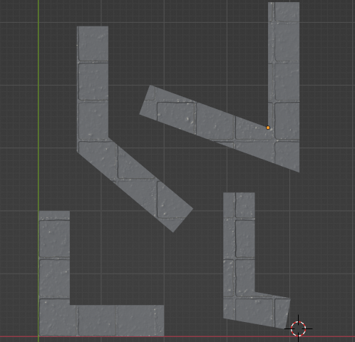
### Tile Options

#### Base
L Floors support OpenLOCK, Plain and None base types. You can choose whether the sockets appear on the long or short side of the tile by changing the angle. Between 0° and 180° the socket will appear on the long side and between 180° and 360° on the short side.

#### Main
Whether to apply a material or not to the main part of the tile.

#### Base Socket Type
If you choose the OpenLOCK base type you can choose from OpenLOCK or LastLOCK style sockets. LastLOCK sockets are compatible with openLOCK style clips but can also be used with ball magnets.

#### Floor Material
The material to apply.

#### Tile Properties
##### Leg 1 Length
The length of the first leg. With the default angle this is the leg that extends along the X axis.
##### Leg 2 Length
The length of the second leg. With the default angle this is the leg that extends along the Y axis.
##### Base Angle
The angle between the two legs.
##### Height
The overall height of the tile.
#### Core Properties
##### Width
The width of each leg of the tile.
#### Sync Proportions
Whether to sync the proportions of the base and the main part of the tile.
#### Base Properties
##### Height
The height of the base.
##### Width
The width of each leg of the base.
#### Subdivision Density
The density of the tile on creation. This cannot be changed after creation.
#### UV Island Margin
The gap between UV islands on the displacement texture created when you click Make3D. Tweak this is you get the texture projecting where it shouldn't.

## L Wall
L Walls are analagous to L Floors and can be used to create angled wall tiles. The length of both legs and the angle between them can be set individually.

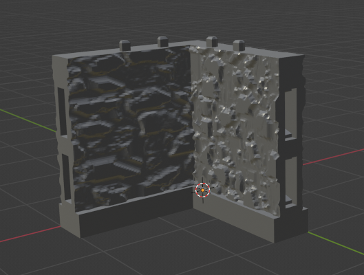

### Tile Options

#### Base
L Walls support OpenLOCK, Plain and None base types. You can choose whether the sockets appear on the long or short side of the tile by changing the angle. Between 0° and 180° the socket will appear on the long side and between 180° and 360° on the short side.

#### Main
You can choose the main part of the tile to be Plain, OpenLOCK or it can be omitted alltogether if you choose None

#### Base Socket Type
If you choose the OpenLOCK base type you can choose from OpenLOCK or LastLOCK style sockets. LastLOCK sockets are compatible with openLOCK style clips but can also be used with ball magnets.

#### Wall Material
The material to apply to the vertical part of the tile.

#### Tile Properties
##### Leg 1 Length
The length of the first leg. With the default angle this is the leg that extends along the X axis.
##### Leg 2 Length
The length of the second leg. With the default angle this is the leg that extends along the Y axis.
##### Base Angle
The angle between the two legs.
##### Height
The overall height of the tile.

#### Core Properties
##### Width
The width of each leg of the tile.
#### Sync Proportions
Whether to sync the proportions of the base and the main part of the tile.
#### Base Properties
##### Height
The height of the base.
##### Width
The width of each leg of the base.

#### Subdivision Density
The density of the tile on creation. This cannot be changed after creation.

#### UV Island Margin
The gap between UV islands on the displacement texture created when you click Make3D. Tweak this is you get the texture projecting where it shouldn't.

## Rectangular Floor
Rectangular Floor Tiles create square or rectangular floors. If you wish to create wall on floor type tiles please see the [straight wall](#straight-wall) tiles.

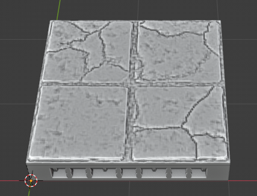
### Tile Options

#### Base
Bases can be OpenLOCK, Plain or omitted with None.

#### Main
The textured part of the base can be Plain or omitted with None.

#### Base Socket Type
If you choose the OpenLOCK base type you can choose from OpenLOCK or LastLOCK style sockets. LastLOCK sockets are compatible with openLOCK style clips but can also be used with ball magnets.

#### Floor Material
Here you can set the material to be applied to the top of the tile.

#### Tile Size
The dimensions of the tile.

#### Lock Proportions
Whther to sync the size of the base and main part of the tile.

#### Base Size
The dimensions of the base.

#### Subdivision Density
The density of the tile on creation. This cannot be changed after creation.

#### UV Island Margin
The gap between UV islands on the displacement texture created when you click Make3D. Tweak this is you get the texture projecting where it shouldn't.

## Roof
The roof tile type is more complex than the others and currently supports the creation of three different types of roofs: Apex, Butterfly and Shed. Because of its' complexity generation of roof tiles takes longer than other tile types.

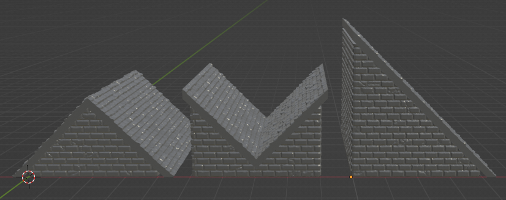

Unlike the other tile types you cannot set the height of roofs directly. Instead you decide the dimensions of their rectangular footprint and the pitch (angle) of the roof and the height is calculated from that by MakeTile.

You can also control the amount the eaves project from the front, back and sides and how much room is left for texture displacement with the wall inset correction control.

You can choose whether to generate the roof, gables or both and in practice you can use the roof generator to create roofs in two ways:

### Default
If you use the default settings the roof and gables will be created together as a solid block.

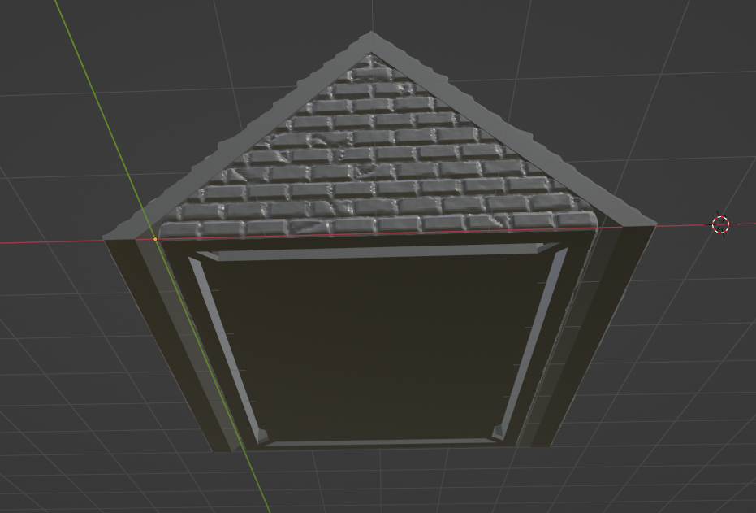

### Seperate Roof and Eaves
You can also create three seperate tiles, one for each gable and a separate one for the rooftop. You can then either combine these in MakeTile or print them seperately for a detachable roof. If you do want to print them separately it is best to set the base height to 0 and make the gables slightly smaller so everything fits together correctly.

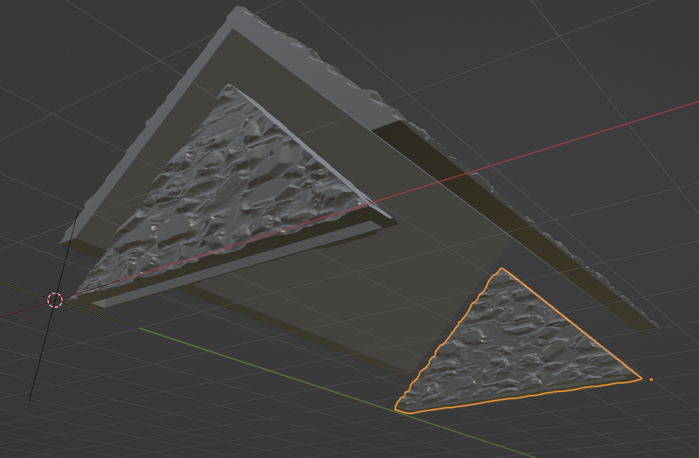
### Tile Options

#### Roof Type
The type of roof to generate.

#### Gable
Whether to generate the gable.

#### Rooftop
Whether to generate the rooftop.

#### Materials
##### Gabe Material
The material to apply to the gable ends.

##### Rooftop Material
The material to apply to the rooftop.

#### Bottom Socket
Whether to generate and openLOCK style socket on the bottom of the gable.

#### Roof Footprint
The rectangular footprint of the roof.

#### Roof Properties
##### Roof Pitch
The roof pitch (Angle)

##### Positive End Eaves
How far out the Eaves should extend on the positive Y axis.

##### Negative End Eaves
How far out the eaves should extend on the negative Y axis.

##### Roof Thickness
The thickness of the roof top.

##### Side Eaves
How far out the eaves should project on the sides.

##### Base Height
The height of the vertical part of the gables.

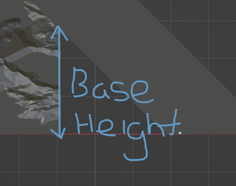

##### Wall Inset Correction
This is the amount of space left for the projection texture.

#### Subdivision Density
The density of the tile on creation. This cannot be changed after creation.

#### UV Island Margin
The gap between UV islands on the displacement texture created when you click Make3D. Tweak this is you get the texture projecting where it shouldn't.

## Semi Circular Floor
You can create two types of semi circular floor tiles, positively and negatively curved. While the positively curved semi circular tiles generally behave themsleves the negatively curved tile generator is still a little glitchy. Textures can also appear pinched at the default level of subdivision on negatively curved tiles. After tile creation tweak the first Subdivisions setting (below the Tile Type selector) and increase it from 3 to 5.

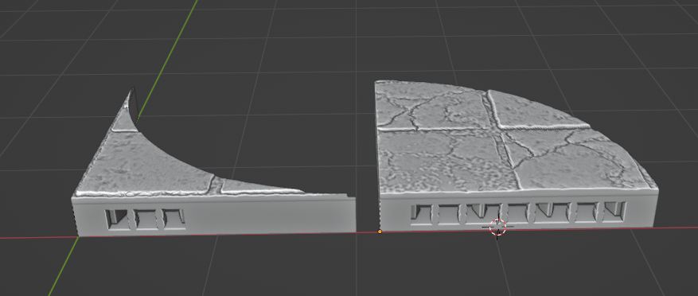
#### Base
Bases can be OpenLOCK, Plain or omitted with None.

#### Main
The textured part of the base can be Plain or omitted with None.

#### Base Socket Type
If you choose the OpenLOCK base type you can choose from OpenLOCK or LastLOCK style sockets. LastLOCK sockets are compatible with openLOCK style clips but can also be used with ball magnets.

#### Floor Material
Here you can set the material to be applied to the top of the tile.

#### Tile Properties
##### Height
The overall height of the tile.
##### Radius
The radius of the tile.
##### Angle
The base angle of the tile.
#### Curve Type
Whether the tile is positively or negatively curved.

#### Sync Proportions
Whether to sync the proportions of the base and the main part of the tile.
#### Base Properties
##### Height
The height of the base.
#### Subdivision Density
The density of the tile on creation. This cannot be changed after creation.

#### UV Island Margin
The gap between UV islands on the displacement texture created when you click Make3D. Tweak this is you get the texture projecting where it shouldn't.

## Straight Wall
Use to create straight wall tiles. These can either be stand alone or wall-on-floor (S-Wall) type tiles

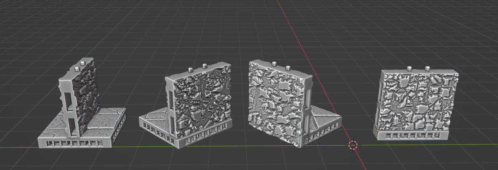

### Tile Options

#### Base
You have 5 options. OpenLOCK (the default), OpenLOCK S-Wall which is a wall on floor type tile. None, which will entirely omit the base, Plain and Plain S-Wall. S-Wall tiles also support the Exterior wall type.

#### Main
You can choose between OpenLOCK, Plain and None main parts

#### Base Socket Type
If you choose the OpenLOCK base type you can choose from OpenLOCK or LastLOCK style sockets. LastLOCK sockets are compatible with openLOCK style clips but can also be used with ball magnets.

#### Floor Material
If you are generating and S-Wall you can choose the floor material here.

#### Wall Material
You can choose the wall material here.

#### Tile Size
The overall tile dimensions.

#### Core Size
The width of the main part of the tile

#### Floor Thickness
The thickness of the floor if you are generating and S-Wall

#### Wall Position
Whether the wall is positioned on the center or side of the tile. Th Exterior wall type allows you to make exterior walls if you are using S-Walls. Exterior walls are slower to generate.

#### Sync Proportions
Whether to sync the proportions of the base and the main part of the tile.

#### Base Size
The size of the tile base

#### Subdivision Density
The density of the tile on creation. This cannot be changed after creation.

#### UV Island Margin
The gap between UV islands on the displacement texture created when you click Make3D. Tweak this is you get the texture projecting where it shouldn't.

## Triangular Floor
Generate a triangular floor tile. The base angle and leg length can be set independently. If the triangle is an isosceles right triangle (both legs are equal length and angle is 90°) and it is an OpenLOCK triangle it will have sockets on all three sides. Otherwise it will have sockets on two sides if it is an OpenLOCK tile.

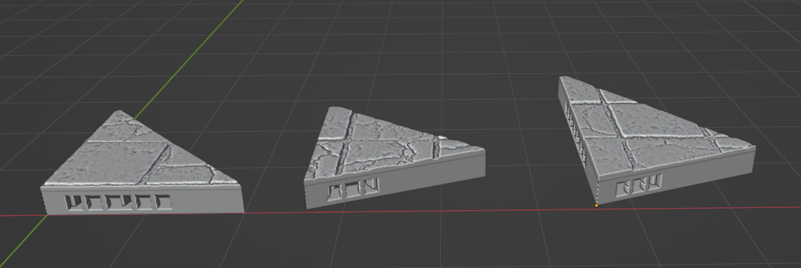
### Tile Options

#### Base
Whether it has an OpenLOCK, Plain or no base

#### Main
Whether to have a Plain or None top of the tile.

#### Base Socket Type
If you choose the OpenLOCK base type you can choose from OpenLOCK or LastLOCK style sockets. LastLOCK sockets are compatible with openLOCK style clips but can also be used with ball magnets.

#### Floor Material
The material to add to the floor.

#### Tile Properties
##### Tile Height
The overall tile height.
##### Leg 1 Length
The length of the first leg.
##### Leg 2 Length
The length of the second leg.
##### Angle
The base angle of the tile.

#### Sync Proportions
Whether to sync the proportions of the base and the main part of the tile.

#### Base Properties
##### Base Height
The height of the base.
#### Subdivision Density
The density of the tile on creation. This cannot be changed after creation.

#### UV Island Margin
The gap between UV islands on the displacement texture created when you click Make3D. Tweak this is you get the texture projecting where it shouldn't.

## U Wall
U Wall tiles are useful for creating doorways at the end of corridors or sides of buildings. You can set the length of each leg and the base wall independently.
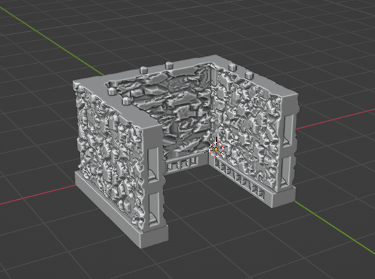

### Tile Options

#### Base
You can choose from OpenLOCK, Plain or None base types.
#### Main
You can choose from OpenLOCK, Plain or None for the main part of the tile.

#### Base Socket Type
If you choose the OpenLOCK base type you can choose from OpenLOCK or LastLOCK style sockets. LastLOCK sockets are compatible with openLOCK style clips but can also be used with ball magnets.

#### Wall Material
Here you can set the wall material.

#### Tile Properties
##### Height
The wall height.
##### Leg 1 Length
The length of the first leg
##### Leg 2 Length
The length of the second leg.
##### End Wall Length
The length of the end wall.
#### Core Properties
##### Width
The thickness of the main part of the wall.
#### Sync Proportions
Whether to sync the proportions of the base and the main part of the tile.

#### Base Properties
Set the width and height of the base.

#### Base Socket Side
Whether the socket is on the inside or outside of the wall if you are creating an OpenLOCK tile.

#### Subdivision Density
The density of the tile on creation. This cannot be changed after creation.

#### UV Island Margin
The gap between UV islands on the displacement texture created when you click Make3D. Tweak this is you get the texture projecting where it shouldn't.